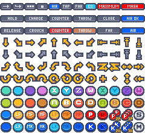

# brokenIKEMEN Glyphs v1.1
> Ikemen GO glyphs created by two4teezee for the brokenIKEMEN screenpack and two4teezee's own website.
---
This glyphs pack for Ikemen GO contains iconography for all buttons and command shorthands currently supported by Ikemen GO's glyphs feature, along with some extras not currently supported by the engine.

This repo contains `.sff` files for two versions of the glyphs, with and without shadows.
Additionally, in the `src` folder, you'll find a tilemap of the glyphs without shadows, and tiles with and without shadows for all glyphs (to include unsupported glyph types in Ikemen GO at time of release).
The tiles without shadows are `20px`, while the tiles with shadows are `26px`.



This release uses Kenney's ["Input Prompts Pixel 16x"](https://www.kenney.nl/assets/input-prompts-pixel-16) as a starting point for the buttons, some of the motions, and color palette cues.
Big shout out to them for this work.

These glyphs are provided under the Creative Commons Zero 1.0 license (`cc0-1.0`).
You can freely use these assets in personal, educational and commercial projects.
Written permission not required - crediting is appreciated but not required.

## Ikemen GO Glyphs Rubric
Note that the [Ikemen GO Wiki](https://github.com/ikemen-engine/Ikemen-GO/wiki/Miscellaneous-info) is not always up-to-date.
You should consult `motif.lua` for the latest implementation list.

```lua
glyphs =
{
    ['^A'] = {1, 0}, --A
    ['^B'] = {2, 0}, --B
    ['^C'] = {3, 0}, --C
    ['^D'] = {4, 0}, --D
    ['^W'] = {23, 0}, --W
    ['^X'] = {24, 0}, --X
    ['^Y'] = {25, 0}, --Y
    ['^Z'] = {26, 0}, --Z
    ['_+'] = {39, 0}, --+ (press at the same time as previous button)
    ['_.'] = {40, 0}, --...
    ['_DB'] = {41, 0}, --Down-Back
    ['_D'] = {42, 0}, --Down
    ['_DF'] = {43, 0}, --Down-Forward
    ['_B'] = {44, 0}, --Back
    ['_F'] = {46, 0}, --Forward
    ['_UB'] = {47, 0}, --Up-Back
    ['_U'] = {48, 0}, --Up
    ['_UF'] = {49, 0}, --Up-Forward
    ['^S'] = {51, 0}, --Start
    ['^M'] = {52, 0}, --Menu (Select/Back)
    ['^P'] = {53, 0}, --Any Punch (X / Y / Z)
    ['^K'] = {54, 0}, --Any Kick (A / B / C)
    ['^LP'] = {57, 0}, --Light Punch (X)
    ['^MP'] = {58, 0}, --Medium Punch (Y)
    ['^HP'] = {59, 0}, --Heavy Punch (Z)
    ['^LK'] = {60, 0}, --Light Kick (A)
    ['^MK'] = {61, 0}, --Medium Kick (B)
    ['^HK'] = {62, 0}, --Heavy Kick (C)
    ['^3K'] = {63, 0}, --3 Kick (A+B+C)
    ['^3P'] = {64, 0}, --3 Punch (X+Y+Z)
    ['^2K'] = {65, 0}, --2 Kick (A+B / B+C / A+C)
    ['^2P'] = {66, 0}, --2 Punch (X+Y / Y+Z / X+Z)
    ['_-'] = {90, 0}, --Arrow (tap following Button immediately - use in combos)
    ['_!'] = {91, 0}, --Continue Arrow (follow with this move)
    ['~DB'] = {92, 0}, --hold Down-Back
    ['~D'] = {93, 0}, --hold Down
    ['~DF'] = {94, 0}, --hold Down-Forward
    ['~B'] = {95, 0}, --hold Back
    ['~F'] = {96, 0}, --hold Forward
    ['~UB'] = {97, 0}, --hold Up-Back
    ['~U'] = {98, 0}, --hold Up
    ['~UF'] = {99, 0}, --hold Up-Forward
    ['_HCB'] = {100, 0}, --1/2 Circle Back
    ['_HUF'] = {101, 0}, --1/2 Circle Forward Up
    ['_HCF'] = {102, 0}, --1/2 Circle Forward
    ['_HUB'] = {103, 0}, --1/2 Circle Back Up
    ['_QFD'] = {104, 0}, --1/4 Circle Forward Down
    ['_QDB'] = {105, 0}, --1/4 Circle Down Back (QCB/QDB)
    ['_QCB'] = {105, 0}, --1/4 Circle Down Back (QCB/QDB)
    ['_QBU'] = {106, 0}, --1/4 Circle Back Up
    ['_QUF'] = {107, 0}, --1/4 Circle Up Forward
    ['_QBD'] = {108, 0}, --1/4 Circle Back Down
    ['_QDF'] = {109, 0}, --1/4 Circle Down Forward (QCF/QDF)
    ['_QCF'] = {109, 0}, --1/4 Circle Down Forward (QCF/QDF)
    ['_QFU'] = {110, 0}, --1/4 Circle Forward Up
    ['_QUB'] = {111, 0}, --1/4 Circle Up Back
    ['_FDF'] = {112, 0}, --Full Clock Forward
    ['_FUB'] = {113, 0}, --Full Clock Back
    ['_FUF'] = {114, 0}, --Full Count Forward
    ['_FDB'] = {115, 0}, --Full Count Back
    ['_XFF'] = {116, 0}, --2x Forward
    ['_XBB'] = {117, 0}, --2x Back
    ['_DSF'] = {118, 0}, --Dragon Screw Forward
    ['_DSB'] = {119, 0}, --Dragon Screw Back
    ['_AIR'] = {121, 0}, --AIR
    ['_TAP'] = {122, 0}, --TAP
    ['_MAX'] = {123, 0}, --MAX
    ['_EX'] = {124, 0}, --EX
    ['_^'] = {127, 0}, --Air
    ['_='] = {128, 0}, --Squatting
    ['_)'] = {129, 0}, --Close
    ['_('] = {130, 0}, --Away
    ['_`'] = {135, 0}, --Small Dot
    ['_CHARGE'] = {136,0}, --Charge
    ['_HOLD'] = {137,0}, --Hold
    ['_RELEASE'] = {138,0}, --Release
    ['_MASH'] = {139,0}, --Mash
    ['_CLOSE'] = {140,0}, --Close
    ['_FAR'] = {141,0}, --Far
    ['_AIROK'] = {142,0}, --AIR OK
    ['_THROW'] = {143,0}, --Throw
    ['_COUNTER'] = {144,0}, --Counter
}
```